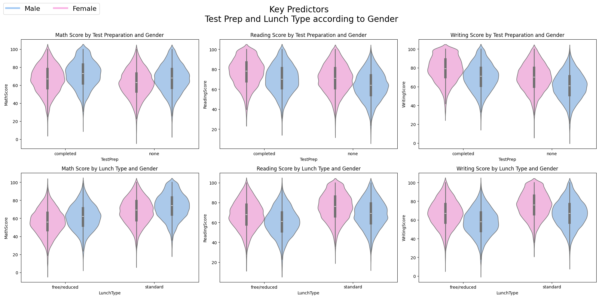
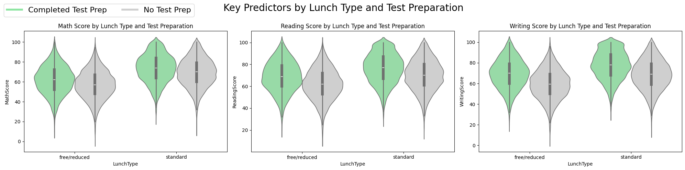

# Data Science Project 2

This repo is for a project done under the Data Science course for Semester 1 Master in Data Science and Analytics.

The purpose of this project is to analyze a dataset containing students performance in exams. This dataset also provides information regarding student's demographic data, and some behvioural data. Multiple Python libraries will be used for cleaning, and visualization such as pandas, matplotlib, and seaborn.

## Contents:
  *  Introduction
  *  Problem Statement
  *  Data Cleaning
  *  Visualization
  *  Insights and Explanations
  *  Conclusion
  *  References
  *  Future Endeavours

This is a copy dataset from [kaggle](https://www.kaggle.com/datasets/desalegngeb/students-exam-scores?select=Expanded_data_with_more_features.csv). The downloaded version can be taken from my [gdrive](https://drive.google.com/file/d/1qkrpsk77nkaKU_vHSH4ZSvl-_5h2KZ47/view?usp=sharing) or from this repo for reproducibility.

## Problem Statement:
 * Are there any interacting features that affect score?
 * Are there any inherent relationship between exam scores?
 * What are the key predictors of academic success?

## Results:

A more in-depth discussion is available within the [jupyter notebook](P153146_Project_2_20242025.ipynb).
